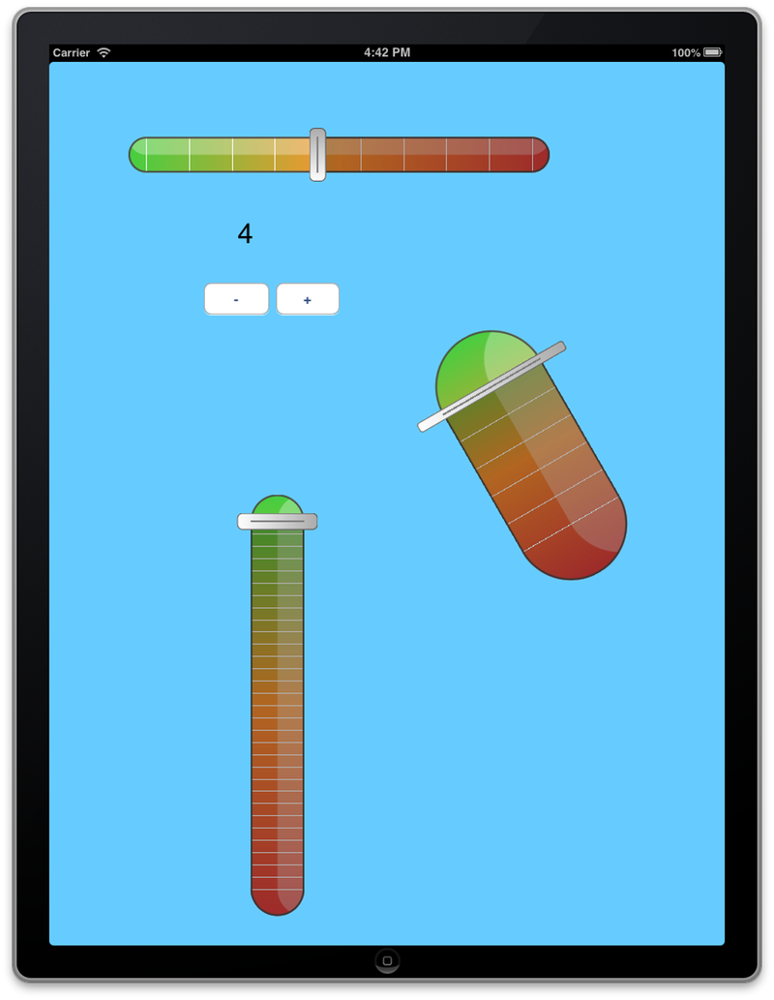

### SQRiskCursor

A custom UIControl using CoreAnimation.

### License

You may use this code for information purpose, but not reuse it as such without Swissquote written authorization.

If you want to use it in your own project, you have to modify SQRiskControl until it doesn't look similar Swissquote's version.

